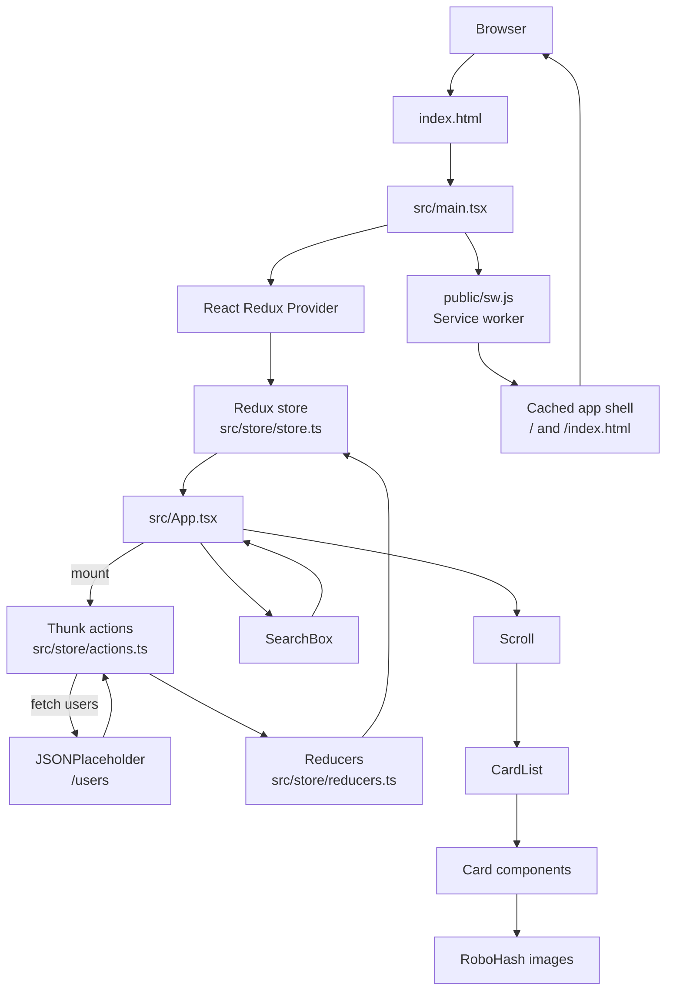

# RoboFriends

RoboFriends is a React 19 + TypeScript single-page app built with Vite. It fetches a list of users from JSONPlaceholder, renders robot-themed cards with RoboHash, and filters the directory by name in real time.

## Live demo

The app is deployed on GitHub Pages:

- https://raushanapp.github.io/robo-friends/

## Quick start

Requires Node.js `^20.19.0` or `>=22.12.0` and pnpm.

```sh
pnpm install
pnpm dev
```

Open the local URL printed by Vite. The app makes live requests to JSONPlaceholder for user data and RoboHash for avatar images.

## Scripts

| Command | Description |
| --- | --- |
| `pnpm dev` | Start the Vite development server. |
| `pnpm build` | Type-check and build the app into `dist/`. |
| `pnpm lint` | Run ESLint. |
| `pnpm preview` | Preview the production build locally. |
| `pnpm deploy` | Publish the built app to GitHub Pages using `gh-pages`. |

## Tech stack

- React 19
- TypeScript
- Vite 8
- Redux 5 + React Redux + Redux Thunk
- pnpm
- GitHub Pages deployment
- Service worker-based offline app shell caching

## How the app works

1. `index.html` provides the `#root` mount element and loads `src/main.tsx`.
2. `src/main.tsx` creates the React root, enables `StrictMode`, and wraps the
 app in the Redux `Provider` using the store from `src/store/store.ts`.
3. `src/App.tsx` connects the page to Redux. On mount, it dispatches
 `requestRobots()` to start the user request.
4. The thunk in `src/store/actions.ts` dispatches a pending action, requests the
 JSONPlaceholder users endpoint, and dispatches either the returned user list
 or an error message.
5. The reducers in `src/store/reducers.ts` update the request state and the
 search text. React Redux passes the relevant state and action dispatchers to
 `App`.
6. `App` shows `Loading...` while the request is pending, shows the error text
 if the request fails, or renders the directory when data is available.
7. Each search input change updates the Redux search text. `App` derives a
 filtered list by comparing that text with each user's name, then passes the
 results through `Scroll` to `CardList`.
8. `CardList` creates one `Card` per matching user. Each card requests its
 image from `https://robohash.org/<user-id>?size=200x200`.

The user records are fetched at runtime; they are not bundled as local seed
data. The app does not have its own backend or database.

## Architecture



## Data flow

The app uses a small Redux store with two main reducers:

- `searchRobots`: stores the current search text
- `requestRobots`: stores the fetched users, loading state, and error state

The fetch response contains user objects with fields such as `id`, `name`, `username`, and `email`. The app currently renders `id`, `name`, and `email` in each card.

## Project structure

```text
robo-friends/
├── dist/                     # Generated production build
├── public/
│   └── sw.js                # Service worker for app-shell caching
├── src/
│   ├── App.tsx              # Main page logic and data flow
│   ├── App.css              # App layout and list styling
│   ├── index.css            # Global styles
│   ├── main.tsx             # App bootstrap and service worker registration
│   ├── assets/              # Static project assets
│   ├── components/
│   │   ├── card.tsx         # Robot card UI
│   │   ├── header.tsx       # App heading
│   │   ├── scroll.tsx       # Scroll container
│   │   ├── search-box.tsx   # Search box input
│   │   └── button.tsx       # Reusable button component
│   ├── hooks/
│   │   └── useCount.ts      # Example hook not used in the main app
│   ├── pages/
│   │   └── card-list.tsx    # Maps user data to cards
│   ├── store/
│   │   ├── actions.ts       # Search and async fetch actions
│   │   ├── constant.ts      # Redux action names
│   │   ├── reducers.ts      # Search and fetch reducers
│   │   ├── store.ts         # Redux store and middleware setup
│   │   └── types.ts         # Action and state typings
│   └── styles/
│       ├── buttom.css       # Button styles
│       ├── crad.css         # Card styling
│       ├── scroll.css       # Scroll styles
│       └── search-box.css    # Search input styles
├── .gitignore
├── eslint.config.js
├── index.html
├── package.json
├── pnpm-lock.yaml
├── tsconfig.json
├── tsconfig.app.json
├── tsconfig.node.json
├── vite.config.ts
└── README.md
```

## Notes

- Search is currently limited to the user's `name` field.
- The app is a frontend-only project; it does not include a backend or database.
- The service worker is intentionally simple and caches the core app shell; it does not implement advanced cache versioning or offline API responses.
- `Button` and `useCount` exist as example pieces and are not connected to the main RoboFriends page.
- The deployment is handled through the GitHub Pages workflow configured with `gh-pages`.

