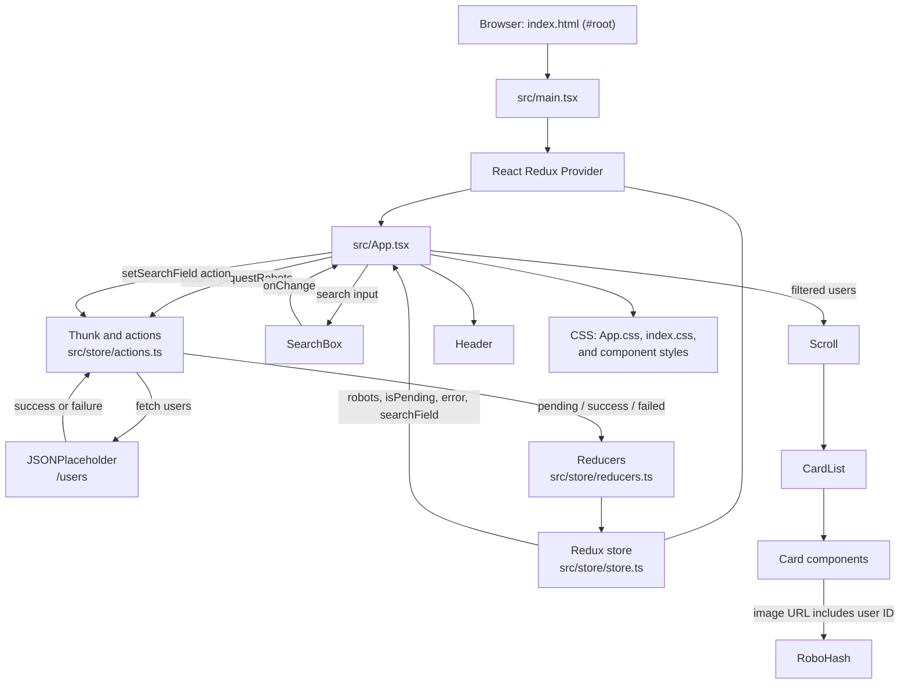

# RoboFriends

RoboFriends is a React 19 and TypeScript single-page app built with Vite. It
fetches users from JSONPlaceholder, shows them as RoboHash cards, and filters
the list by name.

## Live demo

View the deployed app here: [RoboFriends](https://raushanapp.github.io/robo-friends/)

## Quick start

Requires Node.js `^20.19.0` or `>=22.12.0` and pnpm.

```sh
pnpm install
pnpm dev
```

Open the local URL printed by Vite. The app needs network access to
JSONPlaceholder for user data and RoboHash for card images.

## Scripts

| Command        | Description                                |
| -------------- | ------------------------------------------ |
| `pnpm dev`     | Start the development server.              |
| `pnpm build`   | Type-check and build the app into `dist/`. |
| `pnpm lint`    | Run ESLint.                                |
| `pnpm preview` | Preview the production build locally.      |

## Documentation

See [robo_frirend.md](./robo_frirend.md) for the full project guide, including
features, Redux data flow, source structure, and a Mermaid architecture diagram.

# RoboFriends: Project Guide

RoboFriends is a small single-page directory built with React and TypeScript. It
loads user records from JSONPlaceholder, displays each record as a robot-themed
card, and filters the visible cards by name as the user types.

This guide describes the implementation currently in this repository.

## Contents

- [Features](#features)
- [Technology](#technology)
- [Getting started](#getting-started)
- [How the application works](#how-the-application-works)
- [Architecture diagram](#architecture-diagram)
- [State and data flow](#state-and-data-flow)
- [Project structure](#project-structure)
- [Current scope and notes](#current-scope-and-notes)

## Features

- Requests the user list from `https://jsonplaceholder.typicode.com/users` when
  the app mounts.
- Shows a loading message while the request is pending and an error message if
  the request fails.
- Filters the loaded records immediately by **name**, without case sensitivity.
- Displays a card for each matching user, including their name, email, and a
  RoboHash image derived from the user's ID.
- Uses Redux to keep the search text and request state outside the page
  component.
- Uses reusable components for the header, search input, scroll area, and cards.

## Technology

- React 19 and TypeScript
- Vite 8 for development and production builds
- Redux 5, React Redux, Redux Thunk, and Redux Logger
- ESLint for linting
- JSONPlaceholder for user data
- RoboHash for card images
- pnpm (the package declares pnpm 12.4.1)

Vite 8 requires Node.js `^20.19.0` or `>=22.12.0`.

## Getting started

Run these commands from the `react-app-ztm` project directory:

```sh
pnpm install
pnpm dev
```

Open the local URL printed by Vite (normally `http://localhost:5173`). The
browser must be able to reach JSONPlaceholder and RoboHash for the real user
data and avatar images to load.

### Available commands

| Command        | Purpose                                                                  |
| -------------- | ------------------------------------------------------------------------ |
| `pnpm dev`     | Starts the Vite development server with hot reload.                      |
| `pnpm build`   | Type-checks the project and creates a production build in `dist/`.       |
| `pnpm lint`    | Runs ESLint across the project.                                          |
| `pnpm preview` | Serves the already-built `dist/` output locally. Run `pnpm build` first. |

There is no test script configured in `package.json`.

## How the application works

1. `index.html` provides the `#root` mount element and loads `src/main.tsx`.
2. `src/main.tsx` creates the React root, enables `StrictMode`, and wraps the
   app in the Redux `Provider` using the store from `src/store/store.ts`.
3. `src/App.tsx` connects the page to Redux. On mount, it dispatches
   `requestRobots()` to start the user request.
4. The thunk in `src/store/actions.ts` dispatches a pending action, requests the
   JSONPlaceholder users endpoint, and dispatches either the returned user list
   or an error message.
5. The reducers in `src/store/reducers.ts` update the request state and the
   search text. React Redux passes the relevant state and action dispatchers to
   `App`.
6. `App` shows `Loading...` while the request is pending, shows the error text
   if the request fails, or renders the directory when data is available.
7. Each search input change updates the Redux search text. `App` derives a
   filtered list by comparing that text with each user's name, then passes the
   results through `Scroll` to `CardList`.
8. `CardList` creates one `Card` per matching user. Each card requests its
   image from `https://robohash.org/<user-id>?size=200x200`.

The user records are fetched at runtime; they are not bundled as local seed
data. The app does not have its own backend or database.

## Architecture diagram



## State and data flow

The store combines two reducers:

| State branch    | Fields                         | Updated by                                                                  |
| --------------- | ------------------------------ | --------------------------------------------------------------------------- |
| `searchRobots`  | `searchField: string`          | `CHANGE_SEARCH_FIELD`                                                       |
| `requestRobots` | `robots`, `isPending`, `error` | `REQUEST_ROBOTS_PENDING`, `REQUEST_ROBOTS_SUCCESS`, `REQUEST_ROBOTS_FAILED` |

The API's user objects contain `id`, `name`, `username`, and `email`. The card
uses `id`, `name`, and `email`; `username` is fetched but not currently shown.

## Project structure

```text
react-app-ztm/
├── index.html                 # HTML shell and React mount point
├── package.json               # Dependencies and pnpm scripts
├── vite.config.ts             # Vite React plugin configuration
├── src/
│   ├── main.tsx                # React root and Redux Provider
│   ├── App.tsx                 # Request lifecycle, search, and page composition
│   ├── App.css                 # App layout and header/list styles
│   ├── index.css               # Global page styles
│   ├── components/
│   │   ├── header.tsx          # RoboFriends heading
│   │   ├── search-box.tsx      # Search input
│   │   ├── scroll.tsx          # Scrollable content wrapper
│   │   ├── card.tsx            # One user's robot card
│   │   └── button.tsx          # Reusable button component (not used by the page)
│   ├── pages/
│   │   └── card-list.tsx       # Maps users to cards
│   ├── hooks/
│   │   └── useCount.ts         # Counter hook (not used by the page)
│   ├── store/
│   │   ├── store.ts            # Store, middleware, and RootState
│   │   ├── actions.ts          # Search action and async user request
│   │   ├── reducers.ts         # Search and user-request reducers
│   │   ├── types.ts            # Redux state/action types
│   │   └── constant.ts         # Redux action type constants
│   └── styles/
│       ├── buttom.css          # Button styles
│       ├── crad.css            # Card styles
│       ├── scroll.css          # Scroll wrapper styles
│       └── search-box.css      # Search input styles
└── dist/                       # Generated by `pnpm build`
```

## Current scope and notes

- Search is limited to the user's name; it does not search email or username.
- Cards show name and email; no profile detail page or navigation is currently
  implemented.
- `Button` and `useCount` exist as standalone examples but are not connected to
  the RoboFriends page.
- The Redux Logger middleware is installed on the store and logs Redux actions
  and state changes to the browser console.
- The request handler catches fetch/JSON errors, but does not explicitly check
  `response.ok` before parsing the response body.
- Styling is plain CSS; there is no component library or CSS framework.
